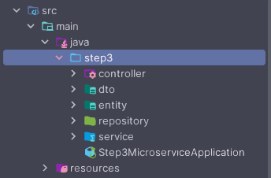

# MICROSERVICE STPA STEP 3 - BACK-END

## Descrição

Este projeto é a implementação do passo 3 da técnica stpa como um microsserviço.

## Tecnologias Utilizadas

<div style="display: flex; gap: 7px; flex-wrap: wrap;">
    
    
    
    
</div>

### Configuração do Ambiente
1. *Requisitos:*
    - JDK 21 (Java Development Kit)
    - Maven 3.8.1
    - MySQL Server 8.0.25
    - Spring Boot 3

2. *Configuração do Banco de Dados:*
    - Crie um banco de dados no MySQL para a aplicação com o nome de `step3`.

## Estrutura do Projeto
O projeto está estruturado da seguinte forma:



## Endpoints da API

- GET
    ```http request
        http://localhost:8080/hazard
    ```
- POST
    ```http request
        http://localhost:8080/hazard
    ```
    ```json
        {
          "name": "teste hazard"
        }
    ```

- PUT
    ```http request
        http://localhost:8080/hazard
    ```
    ```json
        {
          "id": 1,
          "name": "teste atualizar hazard "
        }
    ```
  
- DELETE
    ```http request
        http://localhost:8080/hazard/{id}
    ```

## Instruções para Build e Execução
Para executar este projeto localmente, siga os passos abaixo:

1. *Clonar o repositório:*

    ```shell
       git clone https://github.com/gabriel-piva/step3.git
    ```

2. *Acessar o diretório do projeto:*

    ```shell
       cd step3
    ```

3. *Configurar o banco de dados:*
    - Com o banco já criado como explicamos anteriormente, configure as credenciais de acesso ao banco no arquivo `application.properties` do projeto Spring Boot.

4. *Executar a aplicação:*
   - Você pode executar a aplicação usando a IDE de sua preferência ou pelo Maven. Para executar pelo Maven, execute o comando abaixo no diretório raiz do projeto:
       ```shell
          mvn spring-boot:run
       ```

Após executar a aplicação, você pode testar os endpoints da API usando o Postman.


## Testando requisições com Postman

Você pode acessar todas as requisições da API utilizando o Postman. Fizemos uma coleção com todas as requisições prontas para uso.

- *Coleção no Postman:*
    - Para acessar a coleção de requisições: [Postman Online](https://elements.getpostman.com/redirect?entityId=31588409-5e2d284a-d1ba-4331-9e16-01850fe86053&entityType=collection).

- *Opções de Uso:*
  - Você pode fazer um fork do workspace para ter uma cópia em seu próprio ambiente no Postman Online. Isso permitirá que você edite, teste e utilize as requisições conforme necessário.

  - Se preferir, é possível baixar a coleção de requisições como um arquivo JSON e importá-lo no Postman ou em outras ferramentas compatíveis.

Para importar a coleção no Postman, siga estes passos:

1. Clique no botão "Import" no canto superior esquerdo do aplicativo Postman.
2. Escolha a opção de importação por link e cole o link do workspace ou importe o arquivo JSON baixado.
3. A coleção estará disponível no seu ambiente do Postman para realizar testes e interagir com a API.